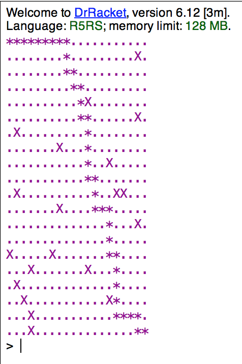

# Dijkstra-Algorithm-Using-Scheme

The goal of this project is to understand the relationship and connections between nondeterministic computing and shortest path finding algorithms, and gain a sense of how these stuff are crucial to programming languages in general and language like Scheme in specific, and develop related techniques by implementing and understanding the problem that we addressed based on the knowledge that we have learned before this project as well as those we learned in the process of finishing this project.

- 
